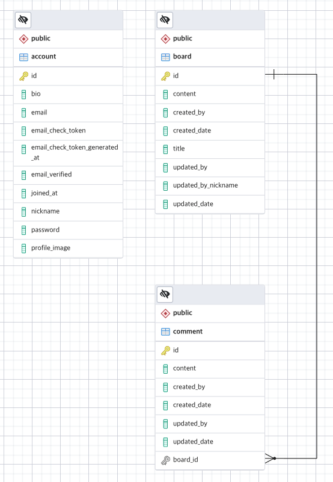

# 포트폴리오(PORTFOLIO)

## Board

#### 1) 프로젝트 소개

* 스프링 부트와 JPA를 이용하여 만드는 게시판 프로젝트

    
    
    * 회원가입, 로그인, 로그아웃
   
    * 게시글 및 댓글 작성 / 수정 / 삭제
    
    * 게시글 목록  
    
        * 페이징 처리 및 검색 기능
    
#### 2) Online Demo

#### 3) 사용 기술
   
* **[Back-end]**

    * `Java 11` 
    
    * `Maven` 
    
    * `Spring Boot 2.2.11`
    
    * `Spring Web`
    
    * `Spring Data JPA`
    
    * `Spring Security` 
    
    * `H2 1.4.200`

    * `PostgreSQL 42.2.18`
    
    * `QueryDSL 4.2.2`

* **[Front-end]**

    * `Bootstrap 4`
    
    * `JQuery 3.5.1`
    
    * `Thymeleaf`

#### 4) 전체 구조


* 요청 및 응답은 `Controller - Service - Repository`와 같은 구조로 이루어진다.

    * ① 웹 브라우저에서 웹 애플리케이션에 요청을 한다.
    
    * ② `Controller`는 클라이언트의 요청에 해당하는 비즈니스 로직 처리를 `Service`에게 요청한다.
    
    * ③ `Service`는 `Controller`가 전달한 요청을 처리하기 위해서 DB 조회를 `Repository`에게 요청한다.
    
    * ④ `Repository`는 `Service`가 전달한 요청을 처리하기 위해서 실제 쿼리를 만든 다음 DB에 전달한다. 
 
        * 데이터베이스는 `Repository`에서 전달한 쿼리를 실행하게 되며 이 결과를 다시 `Repository`에 전달하게 된다.
        
        * 이어서 `Repository -> Service -> Controller` 순서로 결과를 전달하게 된다. 
        
    * ⑤ `Controller`는 `템플릿 엔진`에게 Model 정보를 함께 전달하며 뷰 렌더링을 요청하게 된다.
    
    * ⑥ `템플릿 엔진`은 전달 받은 Model 정보를 참조해서 웹 브라우저가 출력할 결과 화면을 만들게 된다.
    
    * ⑦ 웹 브라우저는 서버로 부터 전달 받은 응답 내용을 화면에 출력하게 된다.
    
#### 5) ERD



#### 6) 에러 발생 및 해결방법

* (1) `org.thymeleaf.exceptions.TemplateInputException: Error resolving template` 에러 발생

    * 인텔리제이에서 실행할 때는 정상적으로 동작 하였지만, 리눅스 서버에 배포하면 컨트롤러에서 뷰 이름을 리턴할 때, 맨 앞에 `/`가 있어서 에러가 발생했다.
    
        ```java
        @GetMapping("/board/{id}/modify")
        public String updateBoardForm(@CurrentAccount Account account, @PathVariable Long id, Model model) {
            // ...
            
            return "/board/modify"
        }
        ```
      
    * 그래서 다음과 같이 맨 앞에 있는 `/`를 제거하여 해결하였다.
    
        ```java
        @GetMapping("/board/{id}/modify")
        public String updateBoardForm(@CurrentAccount Account account, @PathVariable Long id, Model model) {
          // ...
        
          return "board/modify"
        }
        ```
      
        * 타임리프의 자동 설정은 `prefix`를 `classpath:/templates/`로 `suffix`를 `.html`로 설정하게 된다.
        
        * 그러므로 컨트롤러에서 뷰의 이름을 반환할 때, 맨 앞에 `/`를 붙이지 않는 것이 맞다.

* (2) 댓글 관련 테스트 코드 작성 시, `NullPointerException` 에러 발생
      
    * `Board`에서 `private List<Comment> comments;`와 같이 선언 되어 있어서 에러가 발생 하였다.

    * 그래서 다음과 같이 명시적으로 초기화를 하도록 변경 하였다. 

        ```java
        @Entity
        @Getter @Setter @EqualsAndHashCode(of = "id")
        @Builder
        @AllArgsConstructor @NoArgsConstructor
        @ToString(exclude = "comments")
        public class Board {
        
        	/* @JsonIgnore는 특정 속성이 JSON으로 변환되지 않도록 한다. */
        	@JsonIgnore
        	@OneToMany(mappedBy = "board", fetch = LAZY, cascade = CascadeType.ALL)
        	private List<Comment> comments = new ArrayList<>(); // 명시적 초기화
        
        }
        ```

* (3) PostgreSQL에서 `Stale postmaster.pid file` 에러 발생

    * ① 다음과 같은 디렉토리로 이동한다.

        * `cd Library/Application\ Support/Postgres/var-12`

    * ② `postmaster.pid` 파일을 삭제한다.
 
        * `rm postmaster.pid`
        
* (4) 개인 서버에 소스코드를 배포하고 `./mvnw clean package` 명령어를 실행 했을 때, 동작하지 않음

    * 개인 서버에 배포하는 프로젝트는 DB 정보를 포함하고 있어서 따로 관리하려는 의도로 기존 프로젝트를 복사 했었다.  
    
    * 이 과정에서 다음과 같은 숨김 폴더를 누락해서 `./mvnw clean package`가 동작하지 않았다.

        


    